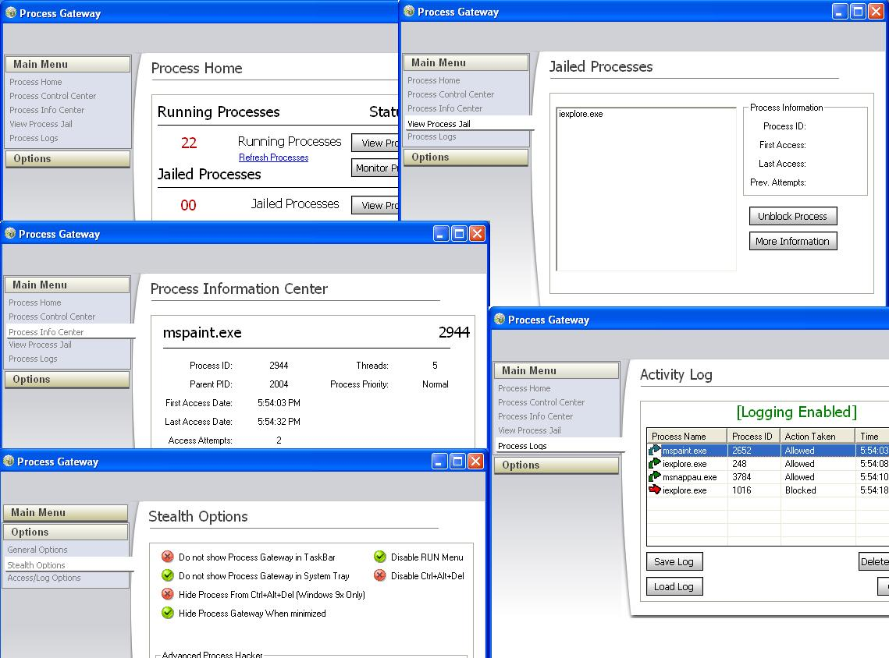



## \[ Process Gateway \[Completed\]\]

### Description

Updated version!!! Process gateway is basically a firewall for processes. It allows you to choose which processes you want to allow to run on your computer. When a new processes is detected, it prompts you to allow or block it. If no option is chosen in 10 seconds it blocks automatically, but that can be disabled. You have the option to password protect all aspects of the program and there are vaious stealth modes. These include hiding itself from taskbar systray, and making itself hidden and only accesable with a Hotkey. It also has the ability to mask itself in CTRL+ALT+DEL (Task Manager). It does this by reading Task Manager memory and editing it. It finds its name and can change it to any other process name, Such as explorer, and in turn change explorer to something else. So if you try ending the process appearing to be Process Gateway, it actually closes another process. Effectivly hiding itself.

Any comments for improvements are welcome. Comment away. Thanks

Note. There may still be bugs. Im also still planning on adding on to it if im presented with some good ideas.
 
### More Info
 

             |
---                |---
**Submitted On**   |2005-04-12 18:19:58
**By**             |[Eric Wolcott](https://github.com/Planet-Source-Code/PSCIndex/blob/master/ByAuthor/eric-wolcott.md)
**Level**          |Intermediate
**User Rating**    |5.0 (159 globes from 32 users)
**Compatibility**  |VB 5\.0, VB 6\.0
**Category**       |[Complete Applications](https://github.com/Planet-Source-Code/PSCIndex/blob/master/ByCategory/complete-applications__1-27.md)
**World**          |[Visual Basic](https://github.com/Planet-Source-Code/PSCIndex/blob/master/ByWorld/visual-basic.md)
**Archive File**   |[\[\_Process\_1876044122005\.zip](https://github.com/Planet-Source-Code/eric-wolcott-process-gateway-completed__1-59427/archive/master.zip)

